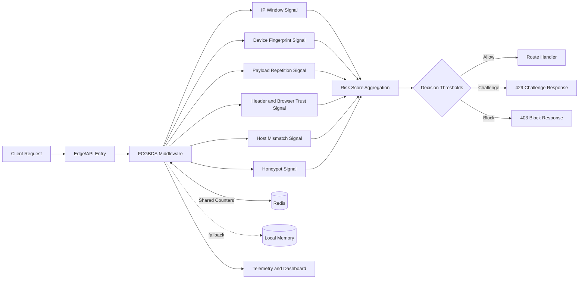

# FCGBDS (Forever Couch Gang Bot Defense System)

FCGBDS is a production bot defense stack you can run in your own system.
This repo now includes the full customer runtime modules, middleware logic, and Cloudflare Worker test clients with placeholder-safe defaults.

License: MIT.
Price: Free.

## Start here

1. System deep dive: `explanative`
2. Contribution guide: `CONTRIBUTING.md`
3. Promotion snippets: `PROMOTION_KIT.md`
4. Benchmark docs: `scripts/benchmark/README.md`
5. Read-only demo: `demo/read-only-dashboard.html`

## Voluntary request from the author

If FCGBDS helps your platform, we ask for one of the following:

1. Donate to @CannaMuffinman.
2. At minimum, publicly state that your platform is protected by FCGBDS.

This is a request, not a legal requirement. The legal terms are MIT.

## What is included

1. Full TypeScript runtime modules in `src/`:
	- `botDefense.ts`
	- `index.ts`
	- `telemetryManager.ts`
	- `updateManager.ts`
	- `dashboard.ts`
	- `licenseManager.ts` (open source compatibility shim, no paid license)
2. Redis state manager reference in `botDefenseRedis.ts`.
3. Cloudflare Worker examples in `cloudflare-workers/`.
4. Docker, deploy scripts, and `.env.example` for quick rollout.

## High-level architecture

FCGBDS uses layered scoring and thresholds to decide whether to allow, challenge, or block incoming traffic.

Primary signal families:

1. IP hit windows.
2. Device fingerprint hit windows.
3. Payload repetition windows.
4. Header and browser consistency checks.
5. Host mismatch checks.
6. Honeypot field detection.

State can run in-memory or Redis-backed for horizontal scaling.



## Quick start

### 1) Install dependencies

```bash
npm install
```

### 2) Configure environment

```bash
cp .env.example .env
```

Set placeholder values in `.env`:

- `FCG_API_BASE_URL=https://PLACEHOLDER_API_BASE_URL`
- `BOT_DEFENSE_EXPECTED_HOSTNAME=api.yourdomain.com`
- `REDIS_URL=redis://localhost:6379` (optional but recommended)

### 3) Run in development

```bash
npm run dev
```

### 4) Build and run production

```bash
npm run build
npm start
```

### 5) Docker option

```bash
docker-compose up -d
```

## How to integrate FCGBDS into your existing API

### Option A: Run FCGBDS as your main edge API middleware

1. Use `src/index.ts` as your entrypoint.
2. Set `BOT_DEFENSE_PATHS` to routes you want protected.
3. Route protected traffic through FCGBDS middleware before business logic.

### Option B: Embed middleware in an existing Express API

1. Import `createBotDefenseMiddleware` from `src/botDefense.ts`.
2. Initialize with your thresholds.
3. `app.use(botDefense.middleware)` before sensitive routes.

### Option C: Shared defense state across multiple API pods

1. Use Redis (`REDIS_URL`) so counters are shared.
2. Keep your pods stateless.
3. Tune windows and thresholds per route profile.

## Cloudflare Workers for testing and simulation

The `cloudflare-workers/` directory includes worker copies you can deploy quickly.
All environment-specific hostnames are replaced with placeholders.

Typical setup per worker:

1. Enter worker folder.
2. Update `wrangler.toml` placeholders.
3. Deploy with Wrangler.

Example placeholders:

- `TARGET_API = "https://PLACEHOLDER_API_BASE_URL"`
- `ALLOWED_TARGET_HOSTS = "PLACEHOLDER_API_HOST,PLACEHOLDER_SECONDARY_API_HOST"`

## Platform integration examples

1. Express example: `examples/express-integration.md`
2. Fastify example: `examples/fastify-integration.md`
3. Twitch webhook integration notes: `examples/platforms/twitch-webhook-integration.md`
4. Kick integration notes: `examples/platforms/kick-webhook-integration.md`

## Benchmarking and performance reporting

Use the built-in benchmark scripts to produce numbers you can publish with reproducible test conditions.

1. Quick run:

```bash
npm run benchmark:quick
```

2. Custom run:

```bash
npm run benchmark -- --url http://127.0.0.1:3001/api/auth/login --connections 50 --duration 30 --method POST
```

3. Full benchmark guide:

- `scripts/benchmark/README.md`

No static RPS or latency claims are hardcoded in this repo. Publish your own measured results with command + environment details.

## Before/after showcase workflow

For stream credibility and auditability, publish anonymized before/after metrics snapshots:

1. Update `demo/sample-metrics.json` with your numbers.
2. Open `demo/read-only-dashboard.html` to visualize the comparison.
3. Share screenshot + benchmark command in your release notes.

## Placeholder safety

This repo intentionally replaces internal infrastructure values with placeholders:

1. `PLACEHOLDER_API_BASE_URL`
2. `PLACEHOLDER_API_HOST`
3. `PLACEHOLDER_APP_HOST`
4. `PLACEHOLDER_WEB_HOST`
5. `PLACEHOLDER_SECONDARY_API_HOST`
6. `PLACEHOLDER_TERTIARY_API_HOST`

Replace these with your own values before deployment.

## Visibility checklist

1. Add GitHub topics to this repo:
	- bot-detection
	- rate-limiting
	- anti-cheat
	- cloudflare
	- redis
	- typescript
2. Use `PROMOTION_KIT.md` for stream overlays and social posts.
3. Add a read-only metrics screenshot from `demo/read-only-dashboard.html` to your repo homepage or posts.

## Security and operations notes

1. Do not log raw user secrets.
2. Keep request body logging minimal and redacted.
3. Use HTTPS only.
4. Rotate tokens and shared secrets regularly.
5. Start with conservative thresholds, then tune with live metrics.

## Repository structure

```text
.
├─ src/
├─ cloudflare-workers/
├─ examples/
├─ scripts/benchmark/
├─ demo/
├─ botDefenseRedis.ts
├─ .env.example
├─ docker-compose.yml
├─ Dockerfile
├─ CONTRIBUTING.md
├─ PROMOTION_KIT.md
├─ deploy.sh
├─ deploy.bat
└─ explanative
```

## Contributing

Contributions are welcome for:

1. New detection signals.
2. Better false-positive controls.
3. Additional worker templates.
4. Better observability and dashboards.

Open an issue or PR with a clear reproduction and expected behavior.
